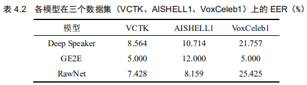
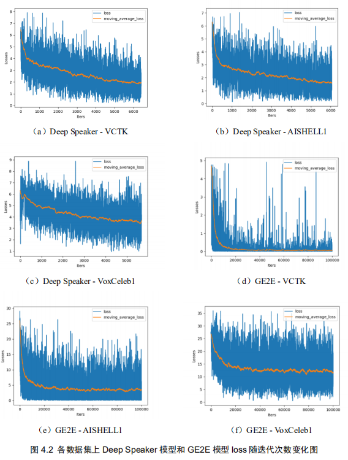
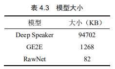
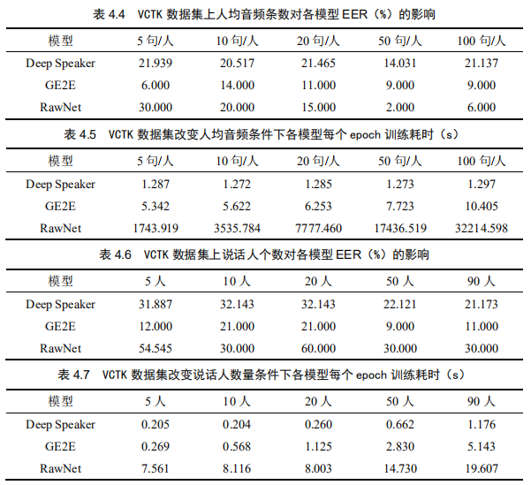

# DeepSpeaker_RawNet_GE2E
分别在VCTK、AISHELL1 和 VoxCeleb1 三个标准公开数据集上对三种端到端声纹模型框架（Deep Speaker, RawNet, GE2E）进行实验比较。

## 过程记录
[Deep Speaker代码解析](https://blog.csdn.net/weixin_40680322/article/details/104620713)

[RawNet代码解析](https://blog.csdn.net/weixin_40680322/article/details/104755909)

[ge2e代码解析](https://blog.csdn.net/weixin_40680322/article/details/104930765)

## 声纹确认demo
SpeakerRecognition_demo使用的是RawNet在VCTK数据集上训练得到的模型，声纹确认demo录屏.mp4为相应的录屏。

## 实验结果与分析
共设置了七组对比分析。第一是各模型在不同数据集上的识别性能比较；第二是不同数据集上Deep Speaker模型和GE2E模型损失随迭代次数的变化比较；第三是不同模型大小比较；第四是VCTK数据集上改变人均音频条数对各模型等错误率的影响；第五是VCTK数据集改变人均音频条数的条件下各模型每个epoch的训练耗时对比；第六是VCTK数据集上改变说话人个数对各模型等错误率的影响；第七是VCTK数据集改变说话人个数条件下各模型每个epoch的训练耗时对比。详细对比结果如下：

表4.2记录了不同数据集上各模型最终测试结果。根据表4.2来看，在VCTK数据集上GE2E模型比Deep Speaker模型好41%左右，比RawNet模型好30%左右，换句话来说就是在文本相关的安静英文语料上GE2E模型表现最优。同理对比AISHELL1数据集上各模型的表现，发现RawNet模型的表现较突出，至少比另外两个模型要好23%，即在文本相关的安静中文普通话语料上RawNet模型表现最优。在VoxCeleb1数据集上我们发现，GE2E模型的表现十分突出，至少比另外两个模型要好77%，即在文本无关带噪声的英文语料上RawNet模型表现最优。

图4.2中图4.2a-图4.2f分别展示的是表4.2实验中不同数据集上Deep Speaker模型和GE2E模型损失随迭代次数的变化。从迭代相同的epoch对比来看，GE2E模型收敛速度比Deep Speaker模型快。由于RawNet模型前端和后端共使用了两个神经网络，无法找到较好的与前两个框架进行损失值变化对比的方法，因此不在此处对比RawNet模型。

表4.3展示的是不同模型的大小。显然RawNet模型最小，是GE2E模型大小的6.5%左右。GE2E模型次之，是Deep Speaker模型的1.3%左右。Deep Speaker模型最大。

表4.4和表4.5分别展示了VCTK数据集上改变人均音频条数对各模型等错误率的影响，以及相应条件下各模型每个epoch的训练耗时。表4.4说明在训练相同的epoch数下，GE2E模型的声纹识别性能比另外两个模型显著的好。另外，从表4.4中发现人均音频条数的增加对RawNet模型识别性能具有相对较大的良性影响。从表4.5发现不同人均音频条数下GE2E模型的训练时间比Deep Speaker模型快至少325倍，同时还发现Deep Speaker模型的训练时间不受人均音频条数的影响，分析原因是Deep Speaker模型选择batch是基于三元组选择的，每个三元组由锚样本、正样本和负样本构成，其中正样本与锚样本来自同一个说话人，负样本与锚样本来自不同说话人，因此每个三元组里同一个说话人最多只会随机选择两条音频，因此改变人均音频数只是扩大了随机选择音频的范围，对每个epoch的训练时间无影响。

表4.6和表4.7分别展示的是VCTK数据集上改变说话人个数对各模型等错误率的影响，以及相应条件下各模型每个epoch的训练耗时。表4.6的实验结果说明在训练相同的epoch数下，GE2E模型的训练结果最突出。此外，从表4.6发现数据规模的增大对Deep Speaker模型识别性能具有相对较大的良性影响。表4.7的实验数据说明了在相同数据规模下，Deep Speaker模型对每个epoch的训练时间比另外两个模型快，比GE2E模型快至少23%，比RawNet模型快至少97%。

对于上述实验中的所有声纹识别任务，分别从不同数据类别上的识别指标、模型大小、改变每个说话人音频数、改变数据规模四方面进行了模型对比。从对比结果可以得出如下结论：

结论1：GE2E模型在英文数据集（文本相关的英文安静数据集、文本无关的英文带噪声数据集）上的识别性能较其余两种模型十分显著；模型大小适中；在不同说话人音频数和不同数据规模条件下的识别性能较稳定；模型训练时间适中。

结论2：RawNet模型在文本相关的中文普通话安静数据集上的识别性能较好，在文本相关的英文安静数据集上的识别性能适中，在文本无关的英文带噪声数据集上的识别性能较另外两类模型差别较大；模型小；识别指标受人均音频条数影响较大，当人均音频条数增加时，该模型识别指标提升显著，训练时长也显著增加；在不同数据规模下的识别性能较稳定；模型训练耗时较高。

结论3：Deep Speaker模型在各类数据集上的识别效果较差；模型较大；该模型受人均音频条数影响小；在大规模数据集上识别性能比在小规模数据集上的识别性能有较小提升；模型训练快。

从上述实验结论发现，GE2E模型的综合性能明显优于另外两个模型，Deep Speaker模型的综合性能比RawNet模型的综合性能稳定。从模型框架角度分析，GE2E模型使用声学特征+循环神经网络+广义端到端损失函数的框架，Deep Speaker模型使用声学特征+卷积神经网络+基于元组的端到端损失函数的框架，RawNet模型使用原始波形+卷积神经网络与循环神经网络的融合结构+基于元组的端到端损失与广义端到端损失的融合损失函数的框架。可以做出如下猜想：

猜想1：循环神经网络比卷积神经网络更适用于说话者嵌入特征的提取。发声器官在发声时相互作用的差异是声纹特征的影响因素之一，这种差异是在发声过程中产生的，因此发声器官在发一个音的前后状态具有序列关系。循环神经网络具有提取时序特征的特点，所提取到的说话者嵌入特征可能更接近特征音空间中的说话者内在表示。

猜想2：与基于元组的端到端损失相比用广义端到端损失训练的模型能够提升识别性能，缩短训练时间。基于元组的端到端损失需要挑选嵌入对进行训练，要求所挑选的嵌入对来自同一说话人的最不相似的两条语音，或者来自不同说话人最相近的两条语音。广义端到端损失不需要挑选嵌入对的过程，节约了挑选时间，提高了数据集的利用率，因此会提升识别性能，缩短训练时间。